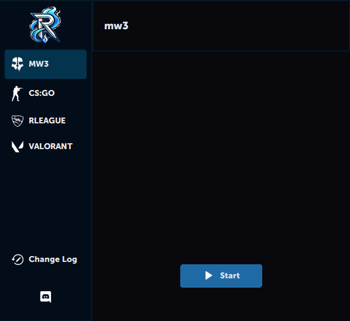

# Rcheat

**Rcheat** is a customizable desktop application built with Python, using the `customtkinter` library for the GUI. The app allows for a dynamic interface with various game-related tabs like MW3, CS:GO, Rocket League, and Valorant. 




## Features

- **Custom Font Installation**: The app checks for and installs custom fonts dynamically --> [About](https://learn.microsoft.com/fr-fr/windows/win32/gdi/windows-gdi)
- **Discord Integration**: Includes a button directly to connected to a discord bot thanks to OAuth 2.0 --> [About](https://discord.com/developers/docs/topics/oauth2)

## Requirements

- Python 3.x
- Libraries:
  - `customtkinter`
  - `tkinter`
  - `Pillow` (PIL)
  - `ctypes`
  - `shutil`
  - `requests`

## Installation

1. Clone the repository:
   ```bash
   git clone https://github.com/your-username/rcheat.git
   cd rcheat
   py rcheat.py 


## Directory Structure

```bash
rcheat/
│
├── img/                      # Image assets like icons and logos
│   ├── logo-transparent_Rcheat.png
│   ├── icon_Rcheat.ico
│   └── ...                   # Additional image files
│
├── src/                      # Source files (fonts, etc.)
│   └── font.ttf              # Custom font
│
├── rcheat.py                 # Main application script
└── requirements.txt          # Python dependencies (soon)


